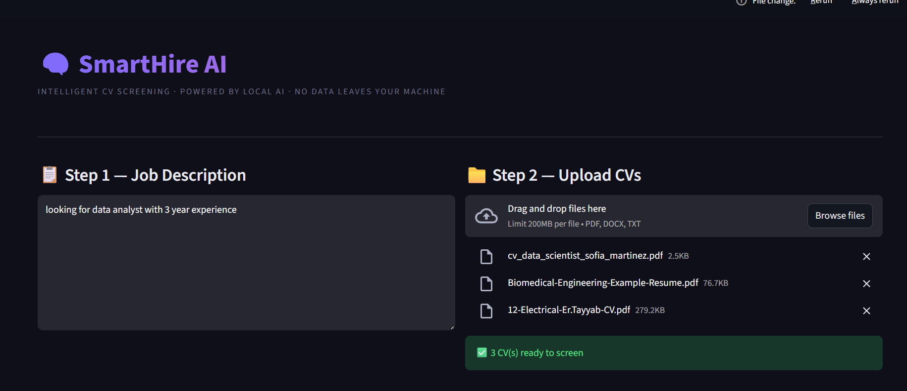
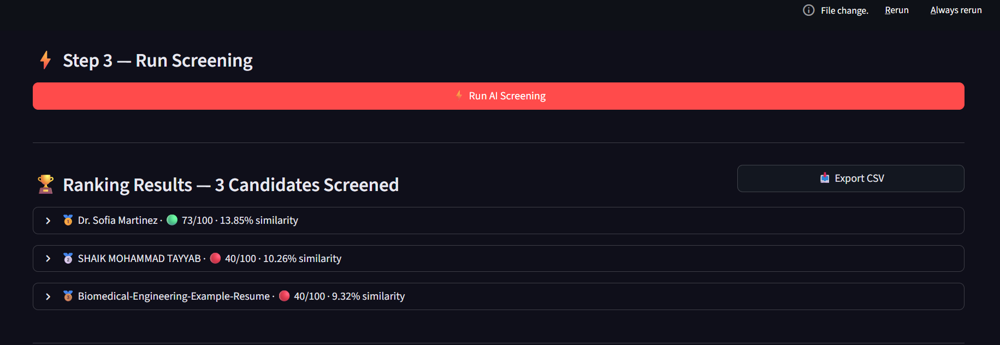
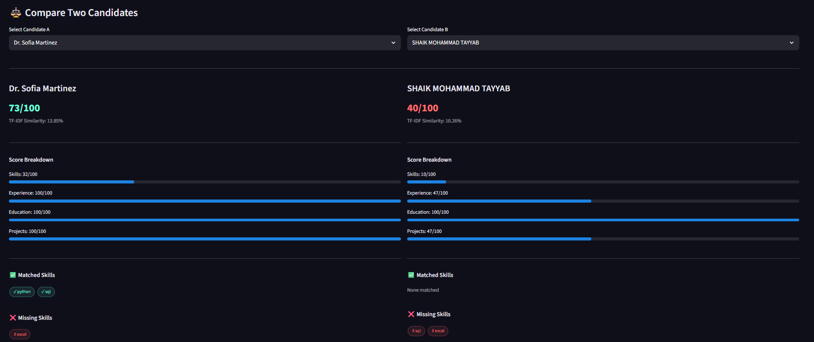
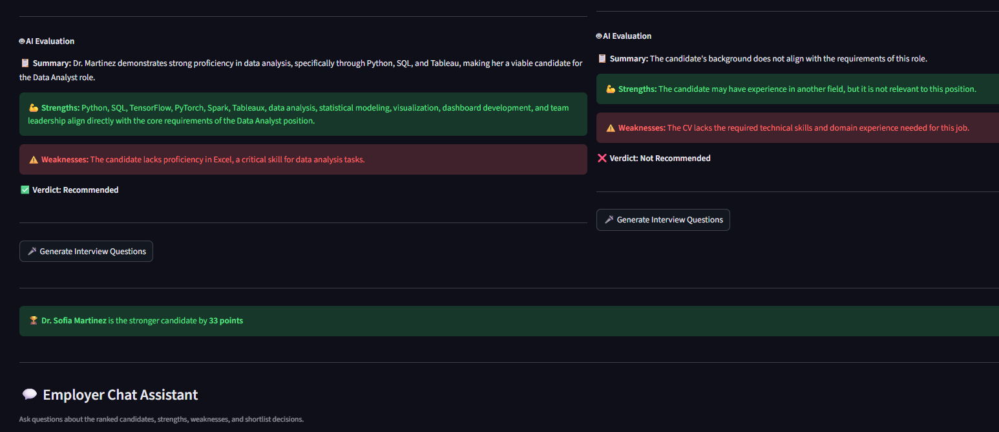

# SmartHire AI
**Intelligent CV Screening · Powered by Local AI · No Data Leaves Your Machine**

> Built for DSAI 4201 — Selected Topics in Data Science  

---

## What It Does

SmartHire AI is an AI-powered CV screening and interview preparation tool. Paste a job description, upload multiple CVs, and the system automatically ranks candidates — explaining why each one is or isn't a good fit, detecting suspicious skill claims, and generating tailored interview questions on demand.

Everything runs **100% locally** using Ollama. No API keys. No data sent to the cloud.

---

## 📸 Screenshots

### Step 1 & 2 — Paste JD and Upload CVs


### Step 3 — Ranked Results


### Candidate Comparison


### AI Evaluation 
 

### Employer Chatbot


---

## Features

- **Hybrid Scoring** — TF-IDF cosine similarity + AI skill extraction combined
- **4-Dimension Scoring** — Skills (40pts) · Experience (30pts) · Education (15pts) · Projects (15pts)
- **Fraud Detection** — Detects candidates who list skills only in a skills section without backing evidence in work history
- **Project Inference** — AI infers skills from project descriptions (e.g. "built REST API" → Python, SQL)
- **Structured AI Evaluation** — Every candidate gets SUMMARY / STRENGTHS / WEAKNESSES / VERDICT
- **Interview Question Generator** — Generates TECHNICAL / BEHAVIORAL / GAP questions tailored to each candidate
- **Candidate Comparison** — Side-by-side view of any two candidates with winner declaration
- **Employer Chatbot** — Ask plain-English questions about the ranked candidates
- **CSV Export** — Download full ranked results

---

## Tech Stack

| Component | Technology |
|---|---|
| UI | Streamlit |
| Local LLM | Ollama (gemma3:1b) |
| Similarity | scikit-learn TF-IDF |
| PDF Reading | PyMuPDF (fitz) |
| DOCX Reading | python-docx |

---

## Project Structure

```
hire/
├── app.py               ← Streamlit UI
├── extractor.py         ← PDF / DOCX / TXT reader
├── scorer.py            ← Full AI scoring pipeline
├── requirements.txt     ← Dependencies
├── README.md
└── screenshots/
    ├── img1.png
    ├── img2.png
    ├── img3.png
    ├── img4.png
    └── img5.png
```

---

## How the Scoring Works

```
CV + JD
  │
  ├─ Step 1: TF-IDF cosine similarity (mathematical baseline)
  ├─ Step 2: AI extracts JD requirements (skills, role, years, education)
  ├─ Step 3: AI extracts CV profile (explicit skills + project inference)
  ├─ Step 4: Fraud detection (cross-validates skills vs work evidence)
  ├─ Step 5: Flexible skill matching (direct + word-level + multi-word fallback)
  ├─ Step 6: Python scoring logic (4 dimensions → total /100)
  ├─ Step 7: AI explanation (SUMMARY / STRENGTHS / WEAKNESSES / VERDICT)
  └─ Step 8: Interview question generator (TECHNICAL / BEHAVIORAL / GAP)
```

### Score Breakdown

| Dimension | Max Points | What It Measures |
|---|---|---|
| Skills | 40 | TF-IDF base + direct skill match bonus × trust score |
| Experience | 30 | Role relevance (20pts) + years match (10pts) |
| Education | 15 | Degree level vs requirement |
| Projects | 15 | Has projects + skill relevance in project descriptions |

---

## Getting Started

### 1. Prerequisites

- Python 3.9+
- [Ollama](https://ollama.com) installed and running
- gemma3:1b model pulled

```bash
ollama pull gemma3:1b
```

### 2. Install Dependencies

```bash
pip install -r requirements.txt
```

### 3. Run the App

```bash
python -m streamlit run app.py
```

---

##  Usage

1. **Paste a Job Description** in Step 1
2. **Upload CVs** (PDF, DOCX, or TXT) in Step 2
3. **Click Run AI Screening** in Step 3
4. View ranked candidates, AI evaluations, and fraud alerts
5. Click **Generate Interview Questions** for any candidate
6. Use **Compare** to view two candidates side by side
7. Use the **Employer Chatbot** to ask questions about the results

---

##  Privacy

All processing happens on your local machine. The Ollama model runs fully offline. No CV data, job descriptions, or results are sent to any external server.

---

### Mohammed Faiz Jabir
- Designed and built the complete AI scoring pipeline from scratch
- TF-IDF cosine similarity as the mathematical baseline for candidate scoring
- 2-layer AI skill extraction — explicit skills from CV text + intelligent inference from project descriptions
- Fraud detection system with per-skill trust scoring to flag unverified claims
- 3-layer flexible skill matching with false positive prevention (stops ecology CVs matching Python)
- 4-dimension weighted scoring engine — Skills (40pts), Experience (30pts), Education (15pts), Projects (15pts)
- AI interview question generator producing tailored Technical, Behavioral and Gap questions per candidate
- Full Streamlit UI — candidate cards, score breakdowns, skill tags, fraud alerts, progress tracking
- Candidate comparison feature with side-by-side scoring and winner declaration
- Session state management so interview buttons don't wipe the page
- CSV export for downstream recruiter use
- extractor.py — PDF (PyMuPDF), DOCX (python-docx), and TXT file reader
- Job Seeker Mode — CV upload, AI profile extraction, live job search via JSearch API, job match scoring, cover letter generator, CV improvement tips (yet to be pushed)

### Delson
- Rewrote the AI explanation module (Step 7) with stricter evaluation logic
- Added hard rejection rule for clearly irrelevant candidates
- Improved AI prompt to stop praising unrelated backgrounds
- Added 3-tier verdict system: Recommended / Potential / Not Recommended
- Built the Employer Chatbot for plain-English candidate Q&A

### Mohd Soad 
- Prepared the complete technical report, including methodology, implementation details, results, and findings
- Created the final presentation slides for project demonstration and evaluation
- Helped validate chatbot outputs and refine response quality across different candidate scenarios
- Assisted in reviewing and improving skill extraction outputs to reduce mismatches
- Contributed to testing the end-to-end system workflow from CV upload to final candidate evaluation
- Helped verify and interpret final system results for reporting and presentation
- Supported final integration checks and overall submission readiness
---

## Academic Context

**Course:** DSAI 4201 — Selected Topics in Data Science

**Categories covered:**
- Cat 5 — NLP Tools (TF-IDF + AI text extraction)
- Cat 8 — Fraud Detection (trust scoring system)
- Cat 9 — Decision Support (ranking, comparison, chatbot)
- Cat 11 — Generative AI (Ollama local LLM, gemma3:1b)
